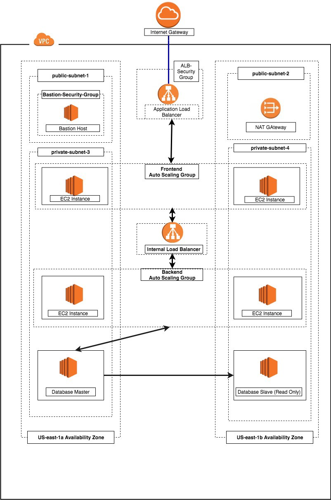

# Problem statement

  

A three-tier architecture is a  architecture pattern where the application is split down into three logical tiers: 
WEB-SERVER: the presentation layer
APP-SERVER: the business logic layer-
DB: the data storage layer.

  

# Approach

  

We  will be desiging the infrastuture with one VPC with 4 subnets(2 public and 2 private)  for various layers. In addition to that there will be a Jump host and IGW-and a NAT gateway for the admins to have access to the infra-structure. We are going to create a Auto scaling group across two availbality zones for the fault tolerance and for high availablity. Below is the proposed architecture model.

  

# Required Services?

 1. VPC
 2. Internet gateway
 3. 4 Subnets (2 public and 2 private in 2 AZ's)
 4. Create two Route tables (public for internet and private for the traffic through NAT Gateway)
 5. Create NAT Gateway
 6.  ELB (Internet and the Internal Load balancer)
 7. Auto Scaling group
 8. Bastion Host

# Options
Terraform , I would be using the DSC IAC tool to define these modules and build the immutable infrastructure.
## THE READ REPLICA IS NOT CREATED IN THIS SOURCE CODE

